# 📋 BÁO CÁO PHÂN TÍCH DỰ ÁN COMIC STORE

> **Dự án**: Hệ thống bán truyện tranh trực tuyến (Comic Store)  
> **Công nghệ**: Laravel (PHP) + Blade + SQLite  
> **Ngày phân tích**: 07/09/2026  
> **Người phân tích**: QA Tester  

---

## 1. TỔNG QUAN DỰ ÁN

### 1.1 Mô tả
Comic Store là một ứng dụng web **thương mại điện tử (e-commerce)** chuyên bán truyện tranh. Hệ thống hỗ trợ bán hàng trực tuyến với đầy đủ luồng từ **duyệt sản phẩm → giỏ hàng → thanh toán → quản lý đơn hàng**, kèm theo hệ thống quản trị (Admin) toàn diện.

### 1.2 Kiến trúc tổng quan

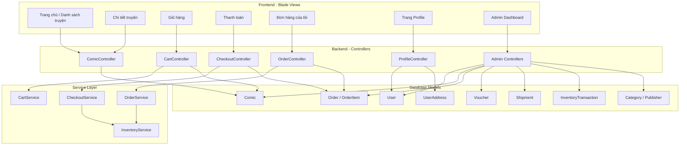

### 1.3 Mô hình phân quyền

| Middleware | Mô tả | Áp dụng |
|---|---|---|
| `guest` | Chưa đăng nhập | Trang login, register |
| `auth` | Đã đăng nhập | Profile, đơn hàng |
| `admin` | Role = `admin` | Toàn bộ admin panel |
| `user` | Role = `user` | Dashboard user |
| *(không có)* | Public | Trang chủ, chi tiết truyện, giỏ hàng, tra cứu đơn |

---

## 2. NHẬN DIỆN ACTORS (TÁC NHÂN)

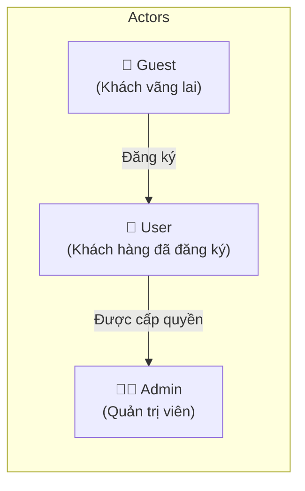

| Actor | Role DB | Mô tả |
|---|---|---|
| **Guest** | *(chưa có tài khoản)* | Người dùng chưa đăng nhập, có thể duyệt truyện, thêm giỏ hàng, đặt hàng, tra cứu đơn |
| **User** | `user` | Khách hàng đã đăng ký, có thể quản lý đơn hàng, profile, địa chỉ |
| **Admin** | `admin` | Quản trị viên, quản lý toàn bộ hệ thống |

---

## 3. PHÂN TÍCH LUỒNG NGHIỆP VỤ THEO TỪNG ACTOR

---

### 3.1 🧑 ACTOR: GUEST (Khách vãng lai)

#### 3.1.1 Luồng: Duyệt & Tìm kiếm truyện

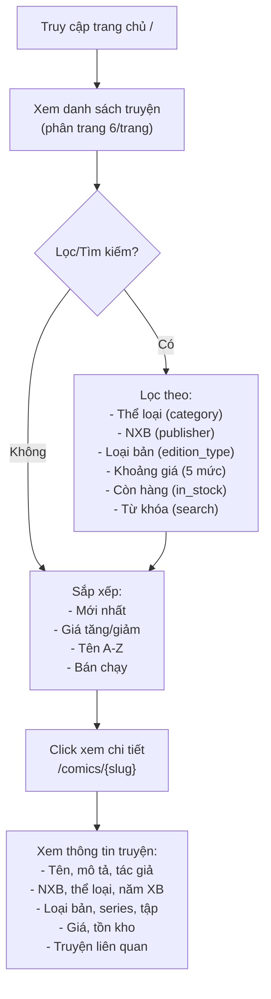

**Các file liên quan:**
- Controller: [ComicController.php](file:///d:/Comic_Store/comic-store/app/Http/Controllers/ComicController.php)
- Model: [Comic.php](file:///d:/Comic_Store/comic-store/app/Models/Comic.php)
- Routes: `GET /` → `home`, `GET /comics/{slug}` → `comics.show`

**Chi tiết nghiệp vụ:**
- Chỉ hiển thị truyện **active** (`is_active = true`)
- Tìm kiếm AJAX: `GET /api/comics/search?q=` → trả JSON, giới hạn 10 kết quả
- API lấy categories/publishers: `GET /api/categories`, `GET /api/publishers`
- Truyện liên quan: cùng `category_id` hoặc cùng `series`, tối đa 4 truyện

---

#### 3.1.2 Luồng: Giỏ hàng (Session-based)

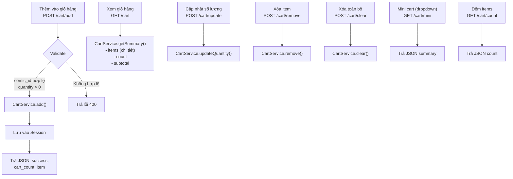

**Các file liên quan:**
- Controller: [CartController.php](file:///d:/Comic_Store/comic-store/app/Http/Controllers/CartController.php)
- Service: [CartService.php](file:///d:/Comic_Store/comic-store/app/Services/CartService.php)

**Chi tiết nghiệp vụ:**
- Giỏ hàng lưu bằng **Session** → Guest cũng có thể dùng
- Tất cả thao tác (add/update/remove/clear) trả về **JSON** → xử lý bằng AJAX
- Validate: `comic_id` phải tồn tại, `quantity` phải hợp lệ

---

#### 3.1.3 Luồng: Thanh toán (Checkout)

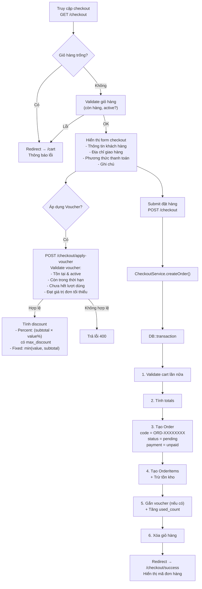

**Các file liên quan:**
- Controller: [CheckoutController.php](file:///d:/Comic_Store/comic-store/app/Http/Controllers/CheckoutController.php)
- Service: [CheckoutService.php](file:///d:/Comic_Store/comic-store/app/Services/CheckoutService.php)

**Chi tiết nghiệp vụ quan trọng:**

| Bước | Mô tả | Ghi chú Test |
|---|---|---|
| Validate cart | Kiểm tra comic tồn tại, active, đủ stock | Test với comic bị xóa/hết hàng giữa chừng |
| Tạo mã đơn | `ORD-` + 8 ký tự random uppercase | Kiểm tra tính unique |
| Trừ kho | `InventoryService.reduceStock()` | Test race condition khi 2 user mua cùng lúc |
| Voucher | Percent hoặc Fixed, có max_discount | Test edge case: discount > subtotal |
| Transaction | Toàn bộ trong DB::transaction | Test rollback khi lỗi giữa chừng |

**Phương thức thanh toán hỗ trợ:**
- `cod` - Thanh toán khi nhận hàng
- `bank_transfer` - Chuyển khoản ngân hàng
- `momo` - Ví MoMo
- `vnpay` - VNPay

> [!IMPORTANT]
> Hiện tại chưa thấy tích hợp thực tế với MoMo/VNPay. Chỉ lưu `payment_method` vào DB, chưa có redirect thanh toán online.

---

#### 3.1.4 Luồng: Tra cứu đơn hàng (không cần đăng nhập)

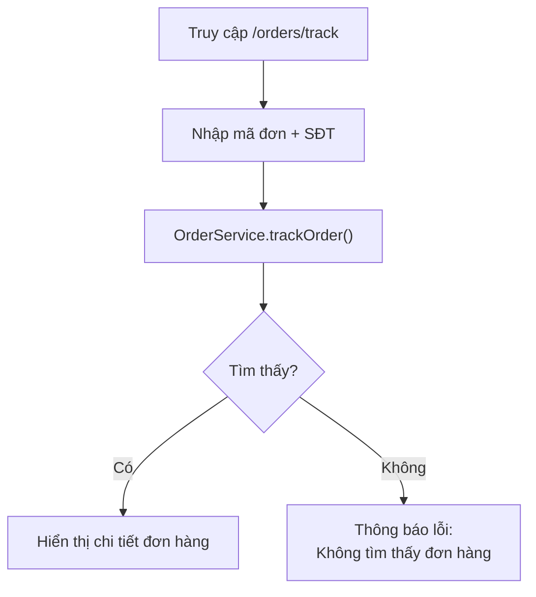

**Chi tiết:** Tìm đơn theo `code` + `customer_phone`. Cho phép Guest kiểm tra trạng thái đơn mà không cần tài khoản.

---

#### 3.1.5 Luồng: Đăng ký / Đăng nhập

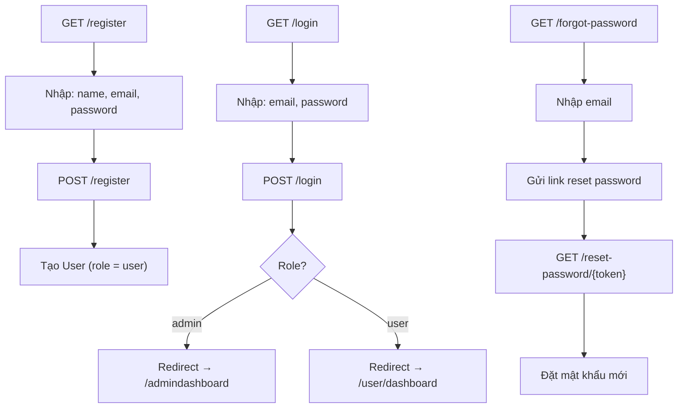

**Các file liên quan:** [auth.php](file:///d:/Comic_Store/comic-store/routes/auth.php)

**Chức năng xác thực:**
- Đăng ký, Đăng nhập, Đăng xuất
- Quên mật khẩu / Reset mật khẩu
- Xác thực email (verify email)
- Xác nhận mật khẩu (confirm password)

---

### 3.2 👤 ACTOR: USER (Khách hàng đã đăng ký)

> Kế thừa tất cả chức năng của Guest + các chức năng sau:

#### 3.2.1 Luồng: Quản lý đơn hàng

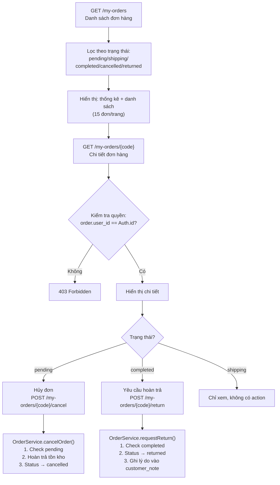

**Các file liên quan:**
- Controller: [OrderController.php](file:///d:/Comic_Store/comic-store/app/Http/Controllers/OrderController.php)
- Service: [OrderService.php](file:///d:/Comic_Store/comic-store/app/Services/OrderService.php)

**Thống kê user (getUserStats):**

| Metric | Mô tả |
|---|---|
| `total_orders` | Tổng số đơn |
| `pending` | Đang chờ xử lý |
| `shipping` | Đang vận chuyển |
| `completed` | Hoàn thành |
| `cancelled` | Đã hủy |
| `total_spent` | Tổng tiền đã chi (chỉ đơn completed) |

---

#### 3.2.2 Luồng: Quản lý Profile & Địa chỉ

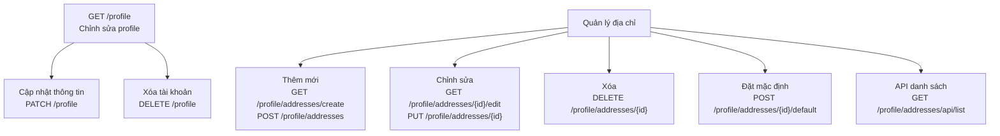

**Các file liên quan:**
- Controller: [ProfileController.php](file:///d:/Comic_Store/comic-store/app/Http/Controllers/ProfileController.php), [UserAddressController.php](file:///d:/Comic_Store/comic-store/app/Http/Controllers/UserAddressController.php)
- Model: [UserAddress.php](file:///d:/Comic_Store/comic-store/app/Models/UserAddress.php)

**Thông tin địa chỉ:**
- `label` - Nhãn (Nhà, Công ty...)
- `recipient_name` - Tên người nhận
- `phone` - Số điện thoại
- `address_line`, `ward`, `district`, `province`, `postal_code`
- `is_default` - Địa chỉ mặc định (chỉ 1 địa chỉ mặc định tại mỗi thời điểm)

---

### 3.3 👨‍💼 ACTOR: ADMIN (Quản trị viên)

#### 3.3.1 Tổng quan chức năng Admin

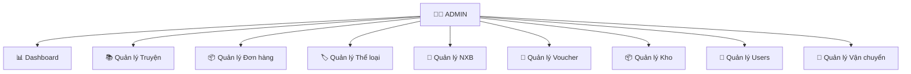

**Đăng nhập Admin riêng:** `GET /admin` → `POST /admin` → sử dụng [AdminLoginController](file:///d:/Comic_Store/comic-store/app/Http/Controllers/Auth/AdminLoginController.php)

---

#### 3.3.2 Luồng: Dashboard

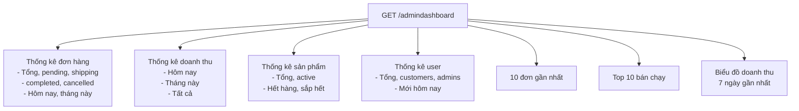

**File:** [DashboardController.php](file:///d:/Comic_Store/comic-store/app/Http/Controllers/Admin/DashboardController.php)

**Lưu ý cho Test:**
- Doanh thu chỉ tính đơn `completed`
- Sản phẩm `low_stock` = stock > 0 && stock ≤ 10
- Top bán chạy: JOIN `order_items` + `orders` WHERE `completed`

---

#### 3.3.3 Luồng: Quản lý Truyện (CRUD)

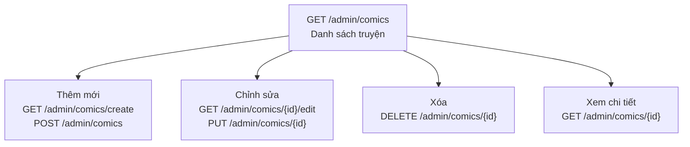

**File:** [Admin/ComicController.php](file:///d:/Comic_Store/comic-store/app/Http/Controllers/Admin/ComicController.php)

**Thuộc tính Comic:**

| Field | Type | Mô tả |
|---|---|---|
| `title` | string | Tên truyện |
| `slug` | string | URL-friendly |
| `description` | text | Mô tả |
| `author` | string | Tác giả |
| `category_id` | FK | Thể loại |
| `publisher_id` | FK | Nhà xuất bản |
| `published_year` | int | Năm xuất bản |
| `edition_type` | string | Loại bản (thường, đặc biệt...) |
| `series` | string | Tên series |
| `volume` | int | Số tập |
| `price` | decimal | Giá bán |
| `cover` | string | Ảnh bìa |
| `stock` | int | Tồn kho |
| `is_active` | bool | Đang bán? |

---

#### 3.3.4 Luồng: Quản lý Đơn hàng

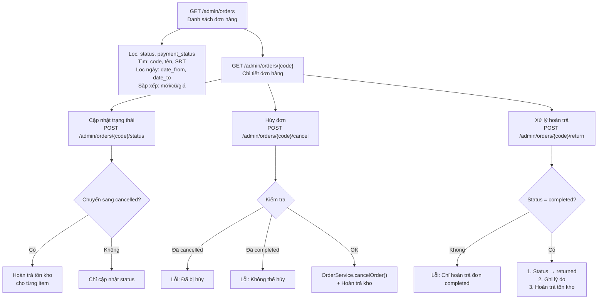

**File:** [Admin/OrderController.php](file:///d:/Comic_Store/comic-store/app/Http/Controllers/Admin/OrderController.php)

**State Machine - Trạng thái đơn hàng:**

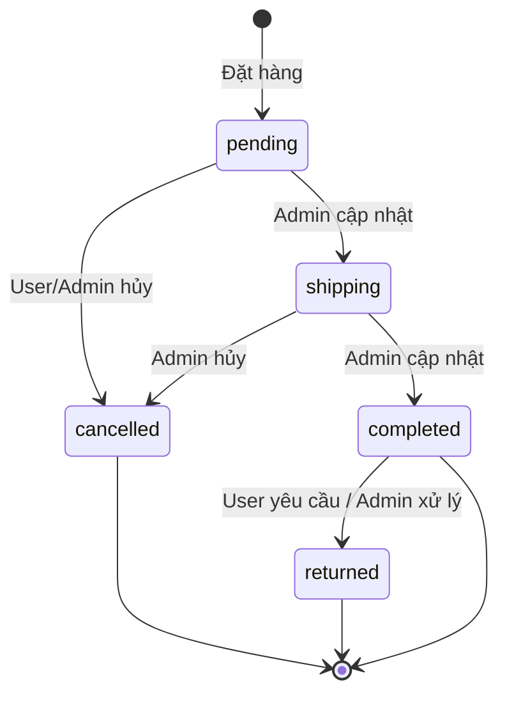

**State Machine - Trạng thái thanh toán:**

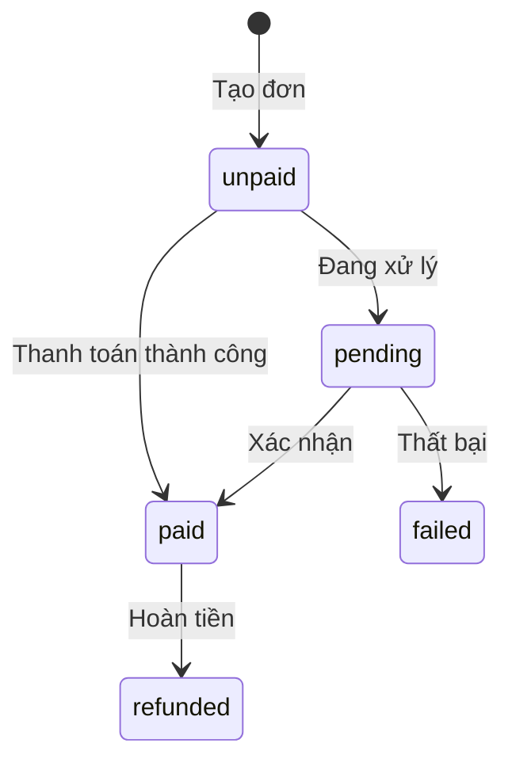

---

#### 3.3.5 Luồng: Quản lý Kho (Inventory)

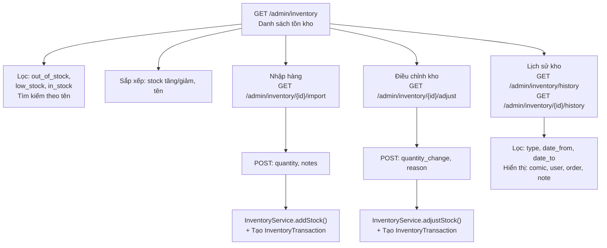

**File:** [Admin/InventoryController.php](file:///d:/Comic_Store/comic-store/app/Http/Controllers/Admin/InventoryController.php), [InventoryService.php](file:///d:/Comic_Store/comic-store/app/Services/InventoryService.php)

**Loại giao dịch kho (InventoryTransaction):**

| Type | quantity_change | Khi nào |
|---|---|---|
| `import` | `+N` | Admin nhập hàng |
| `adjust` | `+N` hoặc `-N` | Admin điều chỉnh |
| `sale` | `-N` | Đặt hàng thành công |
| `restore` | `+N` | Hủy đơn / Hoàn trả |

---

#### 3.3.6 Luồng: Quản lý Voucher

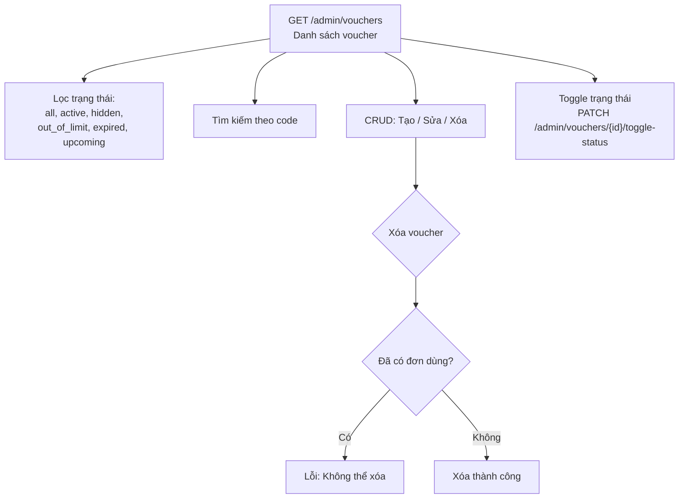

**File:** [Admin/VoucherController.php](file:///d:/Comic_Store/comic-store/app/Http/Controllers/Admin/VoucherController.php)

**Thuộc tính Voucher:**

| Field | Type | Mô tả |
|---|---|---|
| `code` | string | Mã voucher (unique) |
| `type` | enum | `percent` hoặc `fixed` |
| `value` | decimal | Giá trị giảm |
| `max_discount` | decimal? | Giảm tối đa (cho percent) |
| `min_order_amount` | decimal? | Giá trị đơn tối thiểu |
| `usage_limit` | int? | Giới hạn lượt dùng |
| `used_count` | int | Đã dùng bao nhiêu lần |
| `starts_at` | datetime? | Bắt đầu hiệu lực |
| `ends_at` | datetime? | Hết hiệu lực |
| `is_active` | bool | Kích hoạt? |

---

#### 3.3.7 Luồng: Quản lý Thể loại & NXB (CRUD đơn giản)

| Chức năng | Routes | Controller |
|---|---|---|
| Thể loại | `resource('categories')` | [CategoryController.php](file:///d:/Comic_Store/comic-store/app/Http/Controllers/Admin/CategoryController.php) |
| Nhà xuất bản | `resource('publishers')` | [PublisherController.php](file:///d:/Comic_Store/comic-store/app/Http/Controllers/Admin/PublisherController.php) |

---

#### 3.3.8 Luồng: Quản lý Users

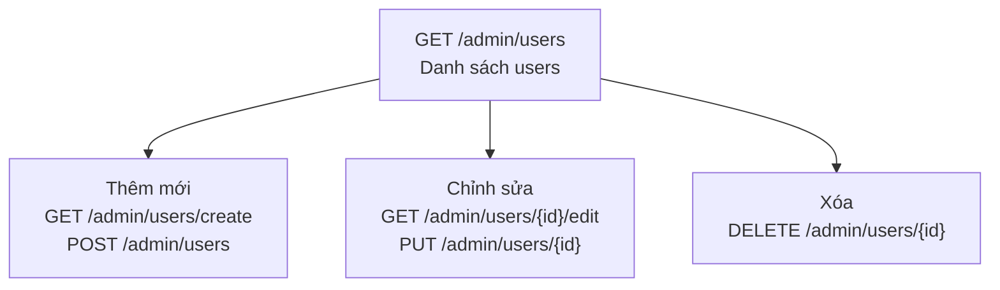

**File:** [Admin/UserController.php](file:///d:/Comic_Store/comic-store/app/Http/Controllers/Admin/UserController.php)

---

#### 3.3.9 Luồng: Quản lý Vận chuyển

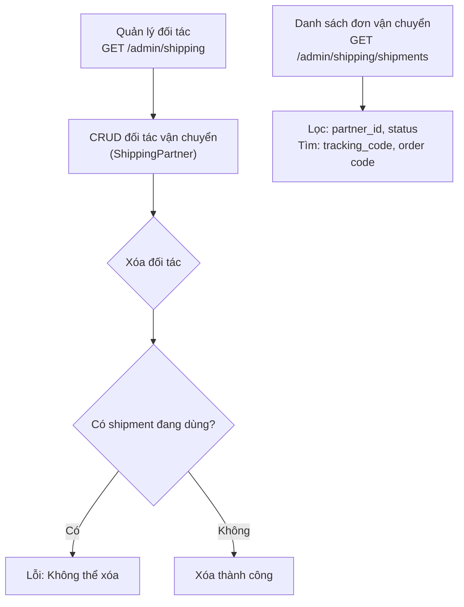

**File:** [Admin/ShippingController.php](file:///d:/Comic_Store/comic-store/app/Http/Controllers/Admin/ShippingController.php)

---

## 4. SƠ ĐỒ QUAN HỆ DỮ LIỆU (ERD)

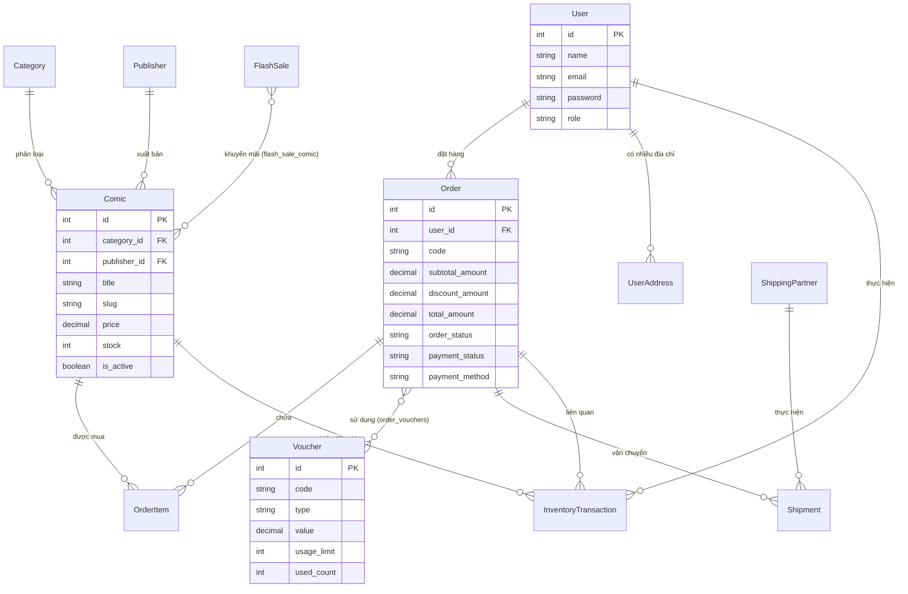

---

## 5. MA TRẬN CHỨC NĂNG THEO ACTOR

| # | Chức năng | Guest | User | Admin |
|---|---|:---:|:---:|:---:|
| 1 | Xem danh sách truyện | ✅ | ✅ | ✅ |
| 2 | Tìm kiếm / Lọc truyện | ✅ | ✅ | ✅ |
| 3 | Xem chi tiết truyện | ✅ | ✅ | ✅ |
| 4 | Thêm giỏ hàng | ✅ | ✅ | ✅ |
| 5 | Quản lý giỏ hàng | ✅ | ✅ | ✅ |
| 6 | Đặt hàng (Checkout) | ✅ | ✅ | ❌ |
| 7 | Tra cứu đơn hàng (mã + SĐT) | ✅ | ✅ | ❌ |
| 8 | Đăng ký tài khoản (`/register`) | ✅ | ❌ | ❌ |
| 9 | Đăng nhập User (`/login`) | ✅ | ✅ | ❌ |
| 10 | Đăng nhập Admin (`/admin`) | ❌ | ❌ | ✅ |
| 11 | Đăng xuất | ❌ | ✅ | ✅ |
| 12 | Quên / Đặt lại mật khẩu | ✅ | ✅ | ❌ |
| 13 | Xem danh sách đơn hàng | ❌ | ✅ | ❌ |
| 14 | Hủy đơn hàng | ❌ | ✅ | ❌ |
| 15 | Yêu cầu hoàn trả | ❌ | ✅ | ❌ |
| 16 | Quản lý profile | ❌ | ✅ | ❌ |
| 17 | Quản lý địa chỉ | ❌ | ✅ | ❌ |
| 18 | Dashboard thống kê | ❌ | ❌ | ✅ |
| 19 | CRUD Truyện | ❌ | ❌ | ✅ |
| 20 | CRUD Thể loại | ❌ | ❌ | ✅ |
| 21 | CRUD NXB | ❌ | ❌ | ✅ |
| 22 | Quản lý đơn hàng (cập nhật status) | ❌ | ❌ | ✅ |
| 23 | Hủy đơn (Admin) | ❌ | ❌ | ✅ |
| 24 | Xử lý hoàn trả | ❌ | ❌ | ✅ |
| 25 | Quản lý kho (nhập/điều chỉnh) | ❌ | ❌ | ✅ |
| 26 | Xem lịch sử kho | ❌ | ❌ | ✅ |
| 27 | CRUD Voucher | ❌ | ❌ | ✅ |
| 28 | Quản lý Users | ❌ | ❌ | ✅ |
| 29 | Quản lý đối tác vận chuyển | ❌ | ❌ | ✅ |
| 30 | Xem đơn vận chuyển | ❌ | ❌ | ✅ |

> [!NOTE]
> **Về Đăng nhập / Đăng ký:**
> - Trang `/login` và `/register` có middleware `guest` → chỉ truy cập được khi **chưa đăng nhập**. Sau khi đăng nhập thành công, Guest trở thành **User** hoặc **Admin** tùy theo `role` trong DB.
> - **User** đăng nhập qua `/login` → redirect về `/user/dashboard`
> - **Admin** có trang đăng nhập riêng tại `/admin` → redirect về `/admindashboard`
> - Cả User và Admin đều có thể đăng xuất (`POST /logout` hoặc `POST /admin/logout`)

---

## 6. LUỒNG NGHIỆP VỤ CHÍNH (END-TO-END)

### 6.1 Luồng mua hàng hoàn chỉnh

```mermaid
sequenceDiagram
    actor G as Guest/User
    participant W as Website
    participant Cart as CartService
    participant CO as CheckoutService
    participant Inv as InventoryService
    participant DB as Database

    G->>W: Duyệt truyện
    G->>W: Click "Thêm vào giỏ"
    W->>Cart: add(comic_id, qty)
    Cart->>Cart: Lưu Session

    G->>W: Vào trang Checkout
    W->>Cart: validate() + getSummary()
    Cart-->>W: items, subtotal

    opt Áp dụng Voucher
        G->>W: Nhập mã voucher
        W->>CO: applyVoucher(code, subtotal)
        CO->>DB: Validate voucher
        CO-->>W: discount amount
    end

    G->>W: Submit đặt hàng
    W->>CO: createOrder(items, data, voucher)

    rect rgb(230, 240, 255)
        Note over CO,DB: DB::transaction
        CO->>CO: validateCart()
        CO->>CO: calculateTotals()
        CO->>DB: Create Order (status=pending)
        loop Mỗi item
            CO->>DB: Create OrderItem
            CO->>Inv: reduceStock(comic_id, qty)
            Inv->>DB: comic.stock -= qty
            Inv->>DB: Create InventoryTransaction(sale)
        end
        opt Có voucher
            CO->>DB: Attach voucher + increment used_count
        end
    end

    CO-->>W: Order created
    W->>Cart: clear()
    W-->>G: Redirect → Success page
```

### 6.2 Luồng xử lý đơn hàng (Admin)

```mermaid
sequenceDiagram
    actor A as Admin
    participant W as Admin Panel
    participant OS as OrderService
    participant Inv as InventoryService
    participant DB as Database

    A->>W: Xem danh sách đơn hàng
    A->>W: Click vào đơn pending

    alt Xác nhận giao hàng
        A->>W: Cập nhật status → shipping
        W->>DB: order.status = shipping
    end

    alt Xác nhận hoàn thành
        A->>W: Cập nhật status → completed
        W->>DB: order.status = completed
    end

    alt Hủy đơn
        A->>W: Click Hủy đơn
        W->>OS: cancelOrder()
        OS->>DB: order.status = cancelled
        loop Mỗi item
            OS->>Inv: restoreStock(comic_id, qty)
            Inv->>DB: comic.stock += qty
            Inv->>DB: Create InventoryTransaction(restore)
        end
    end

    alt Xử lý hoàn trả
        A->>W: Click Hoàn trả (chỉ đơn completed)
        W->>OS: requestReturn()
        OS->>DB: order.status = returned
        loop Mỗi item
            W->>Inv: restoreStock(comic_id, qty)
            Inv->>DB: comic.stock += qty
            Inv->>DB: Create InventoryTransaction(restore)
        end
    end
```

---

## 7. NHẬN XÉT & GỢI Ý KIỂM THỬ

### 7.1 Những điểm cần lưu ý khi Test

> [!WARNING]
> **Race Condition - Tồn kho**: Khi 2 user cùng mua 1 sản phẩm có stock = 1, có thể xảy ra overselling vì chưa có cơ chế lock.

> [!WARNING]
> **Thanh toán online**: Các phương thức MoMo, VNPay chỉ mới lưu vào DB, chưa tích hợp thực tế. Cần verify đơn COD vs online.

> [!IMPORTANT]
> **Guest Checkout**: Guest có thể đặt hàng mà không cần đăng nhập (`user_id` nullable). Cần test luồng Guest vs User checkout riêng.

> [!NOTE]
> **Voucher used_count**: Khi đơn hàng bị hủy, `used_count` của voucher KHÔNG được giảm lại. Đây có thể là bug hoặc business rule cần xác nhận.

### 7.2 Checklist Test theo Actor

#### Guest Testing
- [ ] Duyệt truyện không cần đăng nhập
- [ ] Tìm kiếm, lọc, sắp xếp hoạt động đúng
- [ ] Giỏ hàng hoạt động qua session
- [ ] Checkout không cần đăng nhập
- [ ] Tra cứu đơn bằng mã + SĐT
- [ ] Không thể truy cập `/my-orders`, `/profile`, `/admin`

#### User Testing
- [ ] Đăng ký → Đăng nhập → Redirect đúng
- [ ] Xem/Hủy/Hoàn trả đơn hàng
- [ ] Không xem được đơn của user khác (403)
- [ ] CRUD địa chỉ, set default
- [ ] Không truy cập được admin routes

#### Admin Testing
- [ ] Đăng nhập admin riêng (`/admin`)
- [ ] Dashboard hiển thị số liệu chính xác
- [ ] CRUD truyện/thể loại/NXB/voucher/user
- [ ] Cập nhật status đơn hàng đúng flow
- [ ] Hủy/Hoàn trả đơn → kho tồn được hoàn lại
- [ ] Nhập hàng/Điều chỉnh kho → InventoryTransaction ghi log
- [ ] Không xóa được voucher/đối tác đang có dữ liệu liên quan

### 7.3 Boundary & Edge Cases

| Test Case | Mô tả | Expected |
|---|---|---|
| Stock = 0 | Mua truyện hết hàng | Lỗi validate |
| Stock = 1, qty = 2 | Mua nhiều hơn tồn kho | Lỗi validate |
| Comic inactive | Mua truyện đã ngưng bán | Lỗi validate |
| Voucher expired | Dùng voucher hết hạn | Lỗi: đã hết hạn |
| Voucher max usage | Dùng voucher hết lượt | Lỗi: hết lượt |
| Discount > Subtotal | Voucher fixed lớn hơn đơn | Total = 0 (max 0) |
| Hủy đơn shipping | User hủy đơn đang ship | Lỗi: chỉ hủy khi pending |
| Hoàn trả đơn pending | Hoàn trả đơn chưa completed | Lỗi: chỉ hoàn đơn completed |
| Xóa user có đơn hàng | Admin xóa user đã mua | Kiểm tra cascade/restrict |
| Xóa comic có order | Admin xóa truyện đã bán | Kiểm tra FK constraint |
